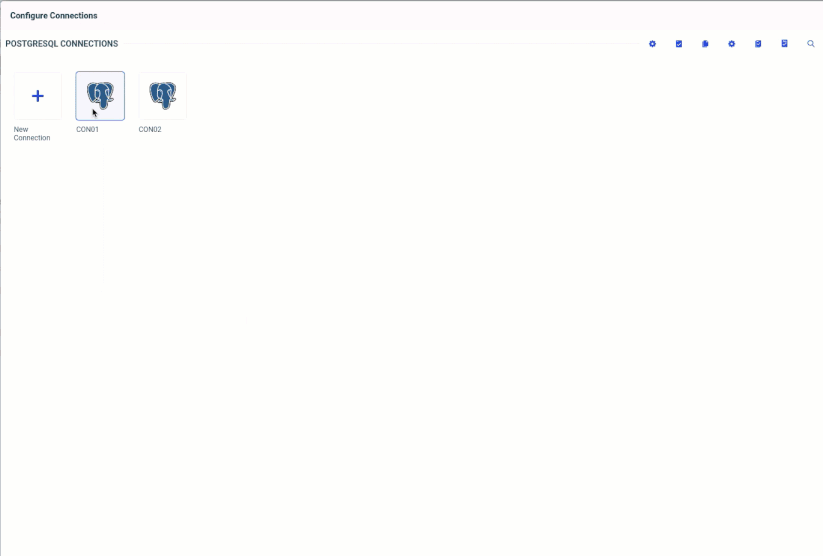
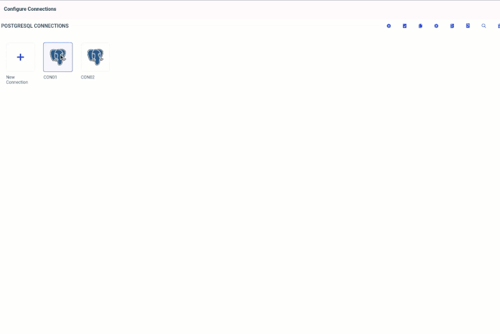

- [Automating Adapter Password Updates in WebFOCUS](#automating-adapter-password-updates-in-webfocus)
   * [Objective](#objective)
   * [Overview](#overview)
   * [Shell Script Details](#shell-script-details)
      + [Script Functionality](#script-functionality)
      + [Sample `edasprof.prf` File](#sample-edasprofprf-file)
   * [Steps to Create the Script and Automation](#steps-to-create-the-script-and-automation)
      + [Note on Using Heredoc Format](#note-on-using-heredoc-format)
      + [Step 1: Create the Shell Script](#step-1-create-the-shell-script)
      + [Step 2: Create the ConfigMap for the Script](#step-2-create-the-configmap-for-the-script)
      + [Step 3: Create the Secret for Username and Password](#step-3-create-the-secret-for-username-and-password)
      + [Step 4: Create the CronJob to Automate the Process](#step-4-create-the-cronjob-to-automate-the-process)
      + [Customizing the `password-update-cronjob.yaml` File](#customizing-the-password-update-cronjobyaml-file)
         - [1. Adjusting the Schedule Interval](#1-adjusting-the-schedule-interval)
         - [2. Changing the Namespace](#2-changing-the-namespace)
         - [3. Updating the Image Name](#3-updating-the-image-name)
   * [Deployment and Testing](#deployment-and-testing)
      + [Check if everting is deployed corretly ](#check-if-everting-is-deployed-corretly)
      + [Check to see if Automation is working as expected](#check-to-see-if-automation-is-working-as-expected)
      + [Sample output when DRY_RUN is set to true:](#sample-output-when-dry_run-is-set-to-true)
   * [Log file ](#log-file)
      + [Sample Log File Output:](#sample-log-file-output)
      + [Log rotation](#log-rotation)
   * [Conclusion and Next Steps](#conclusion-and-next-steps)
   * [Appendix](#appendix)
      + [Overview of the `password-update.sh` Script](#overview-of-the-password-updatesh-script)
      + [Key Features:](#key-features)
         - [Conclusion:](#conclusion)

<!-- TOC end -->

<!-- TOC --><a name="automating-adapter-password-updates-in-webfocus"></a>
# Automating Adapter Password Updates in WebFOCUS

In WebFOCUS, adapter passwords are stored in the `../etc/edasprof.prf` file. To enhance security and ensure that password updates are handled efficiently, we need to automate the process of updating passwords for specified users in this file.

<!-- TOC --><a name="objective"></a>
## Objective

Our objective is to create an automation that will:
- Update the password for a given user in the `edasprof.prf` file.
- Ensure that the automation works seamlessly within a Kubernetes environment where WebFOCUS is running.

<!-- TOC --><a name="overview"></a>
## Overview

We will achieve this by:
1. Writing a shell script that takes a username, password, and dry-run flag as input.
2. This script will:
   - Encrypt the provided password.
   - Update the appropriate entry in the `edasprof.prf` file based on the username.
   - If the database being updated is PostgreSQL, the script will also perform a test connection using the new password. The file will only be updated if the test connection is successful.
   - The script will generate logs and store them in `/opt/ibi/srv/storage/wfs/password-update`.
3. Automating the process using a Kubernetes CronJob that runs periodically to update passwords automatically.
   * In this example it gets new password from a Kubernetes Secret.
   * This is just an example you can update a script to get password from a secret manager like AWS Secrets Manager, Azure Key Vault, etc.

<!-- TOC --><a name="shell-script-details"></a>
## Shell Script Details

<!-- TOC --><a name="script-functionality"></a>
### Script Functionality

The shell script is designed to:
- Look up the adapter entry in the `edasprof.prf` file by username.
- Encrypt the provided password using the `tscom300.out` utility.
- If the JDBC URL is for PostgreSQL, the script will perform a test connection using the new password. If the connection is successful, the password in the file will be updated. Otherwise, the update will be aborted.
- The script supports a `--dry-run` flag that allows you to perform all checks without actually updating the file.
- Log all actions and decisions in a log file stored at `/opt/ibi/srv/storage/wfs/password-update`.

<!-- TOC --><a name="sample-edasprofprf-file"></a>
### Sample `edasprof.prf` File

Here’s a sample of what the `edasprof.prf` file might look like:

```plaintext
-*********************************************************
-* Profile generated on 06 August 2024 at 01:23:35
-*********************************************************
-*
SET LANGUAGE=AMENGLISH
-*
APP PATH RETAIL_SAMPLES GETTING_STARTED BASEAPP
-*
ENGINE SQLPSTGR SET CONNECTION_ATTRIBUTES_EXT {  "name": "CON01","server": "jdbc:postgresql://mydb-db.cu1uam2hhmlc.us-west-2.rds.amazonaws.com:5432/new_db",
  "security_type": "explicit",
  "credentials": {"user": "user8","password": "{AES}1E28C757BEFC4A4A89A065BF962D1299"}}
END
ENGINE SQLPSTGR SET CONNECTION_ATTRIBUTES_EXT {  "name": "CON02","server": "jdbc:postgresql://mydb-db.cu1uam2hhmlc.us-west-2.rds.amazonaws.com:5432/webfocus",
  "security_type": "explicit",
  "credentials": {"user": "webfocus","password": "{AES}695662F8FDFA83737FFF49A0C7AA65100DFEC02B0994442EB13909249AB2E754"}}
END
```

<!-- TOC --><a name="steps-to-create-the-script-and-automation"></a>
## Steps to Create the Script and Automation

<!-- TOC --><a name="note-on-using-heredoc-format"></a>
### Note on Using Heredoc Format

The commands provided below are in [heredoc](https://linuxize.com/post/bash-heredoc/) format. This means you can copy each block of code, paste it directly into your command prompt, and it will automatically create the corresponding file. 

At the end of running all the commands, you will have four files:

- `password-secret.yaml`
- `password-update-cronjob.yaml`
- `password-update-script-configmap.yaml`
- `password-update.sh`

These files will be used to configure and deploy the automation in your Kubernetes environment.


<!-- TOC --><a name="step-1-create-the-shell-script"></a>
### Step 1: Create the Shell Script

Create the shell script using the following command:

```bash
cat <<EOF > password-update.sh
#!/bin/bash

# Get the current timestamp
TIMESTAMP=\$(date '+%Y-%m-%d %H:%M:%S')
LOG_TIMESTAMP=\$(date '+%Y%m%d_%H%M%S')

# Log directory and file setup
LOG_DIR="/opt/ibi/srv/storage/wfs/password-update"
if [ ! -d "\$LOG_DIR" ]; then
  mkdir -p "\$LOG_DIR"
fi
LOG_FILE="\$LOG_DIR/password_update_\$LOG_TIMESTAMP.log"

# Function to log messages
log_message() {
  echo "\$TIMESTAMP - \$1" | tee -a "\$LOG_FILE"
}

# Validate input
if [ -z "\$1" ] || [ -z "\$2" ]; then
  log_message "ERROR: Usage: \$0 <username> <password> [--dry-run]"
  exit 1
fi

USER=\$1
PASSWORD=\$2
DRY_RUN=false

if [ "\$3" == "--dry-run" ]; then
  DRY_RUN=true
  log_message "INFO: Dry run mode enabled"
fi

log_message "INFO: Script started by \$(whoami) on \$(hostname)"

# Check if necessary files exist
CONFIG_FILE="/opt/ibi/srv/storage/wfs/etc/edasprof.prf"
ENCRYPT_TOOL="/opt/ibi/srv/home/bin/tscom300.out"

if [ ! -f "\$CONFIG_FILE" ]; then
  log_message "ERROR: Configuration file \$CONFIG_FILE not found"
  exit 1
fi

if [ ! -f "\$ENCRYPT_TOOL" ]; then
  log_message "ERROR: Encryption tool \$ENCRYPT_TOOL not found"
  exit 1
fi

# Check if psql is installed
if ! command -v psql &> /dev/null; then
  log_message "WARNING: psql could not be found, test connection will not be performed"
  PSQL_AVAILABLE=false
else
  log_message "INFO: psql found on system"
  PSQL_AVAILABLE=true
fi

# Encrypt the password
ENCRYPTED_PASSWORD_OUTPUT=\$(\$ENCRYPT_TOOL -encr "\$PASSWORD")
ENCRYPTED_PASSWORD=\$(echo "\$ENCRYPTED_PASSWORD_OUTPUT" | grep -oP '(?<=\{AES\})[A-F0-9]+')

if [ -z "\$ENCRYPTED_PASSWORD" ]; then
  log_message "ERROR: Failed to encrypt password"
  exit 1
fi

log_message "INFO: Encrypted password generated: \$ENCRYPTED_PASSWORD"

# Initialize flags and variables
UPDATED=false
JDBC_URL=""
URL_FOUND=false

while IFS= read -r LINE; do
  if echo "\$LINE" | grep -q "\"user\": \"\$USER\""; then
    OLD_PASSWORD=\$(echo "\$LINE" | grep -oP '(?<=\{AES\})[A-F0-9]+')
    log_message "INFO: Found entry for user \$USER"
    log_message "INFO: Old password: \$OLD_PASSWORD"
    log_message "INFO: New password: \$ENCRYPTED_PASSWORD"
    
    # Extract JDBC URL
    while IFS= read -r URL_LINE; do
      if echo "\$URL_LINE" | grep -q "\"server\": \"jdbc:postgresql://"; then
        JDBC_URL=\$(echo "\$URL_LINE" | grep -oP '(?<=server": ")[^"]+')
        URL_FOUND=true
        break
      fi
    done
  fi
done < "\$CONFIG_FILE"

if [ "\$URL_FOUND" = true ]; then
  log_message "INFO: Found PostgreSQL URL: \$JDBC_URL"
  if [ "\$PSQL_AVAILABLE" = true ]; then
    DB_HOST=\$(echo "\$JDBC_URL" | sed -n 's|jdbc:postgresql://\([^:/]*\).*|\1|p')
    DB_PORT=\$(echo "\$JDBC_URL" | sed -n 's|.*:\([0-9]\+\)/.*|\1|p')
    DB_NAME=\$(echo "\$JDBC_URL" | sed -n 's|.*/\([^?]*\).*|\1|p')

    log_message "INFO: Testing connection with new password"
    PGPASSWORD=\$PASSWORD psql -h "\$DB_HOST" -p "\$DB_PORT" -U "\$USER" -d "\$DB_NAME" -c '\q'
    if [ \$? -eq 0 ]; then
      log_message "INFO: Connection test successful"
      UPDATED=true
    else
      log_message "ERROR: Connection test failed, password will not be updated"
      UPDATED=false
    fi
  else
    log_message "ERROR: psql not available for testing connection"
    exit 1
  fi
else
  log_message "INFO: No PostgreSQL URL found, proceeding with password update assuming validity"
  UPDATED=true
fi

# Update the configuration file if test succeeded or if no PostgreSQL URL
if [ "\$UPDATED" = true ]; then
  if [ "\$DRY_RUN" = false ]; then
    log_message "INFO: Updating configuration file with new password"
    sed -i.bak "s/{AES}\$OLD_PASSWORD/{AES}\$ENCRYPTED_PASSWORD/" "\$CONFIG_FILE"
    log_message "INFO: Configuration file updated successfully"
  else
    log_message "INFO: Dry run mode: No changes made to the configuration file"
  fi
else
  log_message "ERROR: Password was not updated due to failed test connection"
  exit 1
fi

log_message "INFO: Script completed"
EOF
```

<!-- TOC --><a name="step-2-create-the-configmap-for-the-script"></a>
### Step 2: Create the ConfigMap for the Script

Next, create a ConfigMap that will store the script in your Kubernetes cluster:

```bash
cat <<EOF > password-update-script-configmap.yaml
apiVersion: v1
kind: ConfigMap
metadata:
  name: password-update-script
  namespace: webfocus
data:
  password-update.sh: |
$(sed 's/^/    /' password-update.sh)
EOF
```
<!-- TOC --><a name="step-3-create-the-secret-for-username-and-password"></a>
### Step 3: Create the Secret for Username and Password

Now, create the Kubernetes Secret that will store the base64-encoded username and password:

```bash
cat <<EOF > password-secret.yaml
apiVersion: v1
kind: Secret
metadata:
  name: password-secret
  namespace: webfocus
type: Opaque
data:
  username: $(echo -n 'user8' | base64)     # Replace 'user8' with the actual username
  password: $(echo -n 'myNewPassword123' | base64)      # Replace 'myNewPassword123' with the actual password
EOF
```

<!-- TOC --><a name="step-4-create-the-cronjob-to-automate-the-process"></a>
### Step 4: Create the CronJob to Automate the Process

Finally, create the [CronJob](https://kubernetes.io/docs/concepts/workloads/controllers/cron-jobs/) YAML file:

```bash
cat <<EOF > password-update-cronjob.yaml
apiVersion: batch/v1
kind: CronJob
metadata:
  name: password-update-cronjob
  namespace: webfocus
spec:
  schedule: "*/5 * * * *"
  jobTemplate:
    spec:
      backoffLimit: 0
      template:
        spec:
          containers:
          - name: password-update
            image: 72*******627.dkr.ecr.us-west-2.amazonaws.com/myrepo:wfs-9.3
            command:
            - /bin/sh
            - -c
            - |
              cp /scripts/password-update.sh /tmp/password-update.sh
              chmod +x /tmp/password-update.sh
              USERNAME=\$(cat /secrets/username)
              PASSWORD=\$(cat /secrets/password)
              if [ "\$DRY_RUN" = "true" ]; then
                /tmp/password-update.sh \$USERNAME \$PASSWORD --dry-run
              else
                /tmp/password-update.sh \$USERNAME \$PASSWORD
              fi
            env:
            - name: DRY_RUN
              value: "true" # Default to true
            volumeMounts:
            - name: script-volume
              mountPath: /scripts
            - name: secret-volume
              mountPath: /secrets
              readOnly: true
            - name: storage-volume
              mountPath: /opt/ibi/srv/storage
          restartPolicy: Never
          securityContext:
            runAsUser: 1000
            fsGroup: 1000
          volumes:
          - name: script-volume
            configMap:
              name: password-update-script
          - name: secret-volume
            secret:
              secretName: password-secret
          - name: storage-volume
            persistentVolumeClaim:
              claimName: eda-storage
EOF
```

<!-- TOC --><a name="customizing-the-password-update-cronjobyaml-file"></a>
### Customizing the `password-update-cronjob.yaml` File

When working with the `password-update-cronjob.yaml` file, you might need to adjust certain aspects to fit your specific environment and scheduling needs. Below are the key areas you may need to customize:

<!-- TOC --><a name="1-adjusting-the-schedule-interval"></a>
#### 1. Adjusting the Schedule Interval

The CronJob is currently set to run every 5 minutes. If you want to change this interval to something longer, such as 30 days, you’ll need to update the `schedule` field.

```yaml
spec:
  schedule: "*/5 * * * *"
```

- **Current Setting:** `"*/5 * * * *"` - Runs the CronJob every 5 minutes.
  - **Change to 30 Days:** To run the job every 30 days, use `"0 0 */30 * *"`.
    - **Example:** `"0 0 */30 * *"` - This runs the CronJob at midnight every 30 days.

<!-- TOC --><a name="2-changing-the-namespace"></a>
#### 2. Changing the Namespace

The CronJob is set to run in the `webfocus` namespace. If your environment uses a different namespace, you’ll need to update the `namespace` field in the `metadata` section.

```yaml
metadata:
  namespace: webfocus
```

- **Current Setting:** `namespace: webfocus`
  - **Change to Your Namespace:** Replace `webfocus` with the name of your desired namespace.
    - **Example:** `namespace: my-custom-namespace`

<!-- TOC --><a name="3-updating-the-image-name"></a>
#### 3. Updating the Image Name

The `image` field specifies the container image to use for the CronJob. If you need to use a different image, update the `image` field with the correct image name.

```yaml
containers:
  - name: password-update
    image: 72*******627.dkr.ecr.us-west-2.amazonaws.com/myrepo:wfs-9.3
```

- **Current Setting:** `"72*******627.dkr.ecr.us-west-2.amazonaws.com/myrepo:wfs-9.3"`
  - **Change to Your Image:** Replace the existing image string with your updated image name.
    - **Example:** `"7212332627.dkr.ecr.us-west-2.amazonaws.com/wfcerepo:wfs-9.3-1.3.1-v16-ga"`

#### 4. Dry run 

By default, the script runs in dry run mode - so it will not update the password in the configuration file.
To update the password in the configuration file you need to set `DRY_RUN` to false.

```yaml
env:
- name: DRY_RUN
  value: "true" # Default to true
```


<!-- TOC --><a name="deployment-and-testing"></a>
## Deployment and Testing

1. Apply the Secret, ConfigMap, and CronJob to Kubernetes:  

Run the following commands:
 
```bash
kubectl apply -f password-secret.yaml
kubectl apply -f password-update-script-configmap.yaml
kubectl apply -f password-update-cronjob.yaml
```

2. Test the Setup:

<!-- TOC --><a name="check-if-everting-is-deployed-corretly"></a>
### Check if everting is deployed corretly 

See below commands that you can use to check if Secret , Config Mapd and CronJob is deployed correctly.

```bash
# Check on CronJob
ubuntu::~/update-password$kubectl get cronjobs.batch -n webfocus 
NAME                      SCHEDULE      SUSPEND   ACTIVE   LAST SCHEDULE   AGE
password-update-cronjob   */5 * * * *   False     0        3m3s            9h

# Check on ConfigMap
ubuntu::~/update-password$kubectl get configmaps -n webfocus password-update-script 
NAME                     DATA   AGE
password-update-script   1      13h

# Check on Secret
ubuntu::~/update-password$kubectl get secrets -n webfocus password-secret 
NAME              TYPE     DATA   AGE
password-secret   Opaque   2      18h

# Check on POD created by CronJob ( initially it might take up to 5 minutes to create a POD)
ubuntu::~/update-password$kubectl get pods -n webfocus | grep password
password-update-cronjob-28720365-jfhzt             0/1     Completed   0          14m
password-update-cronjob-28720370-z48rd             0/1     Completed   0          9m35s
password-update-cronjob-28720375-pqqjs             0/1     Completed   0          4m35s
```

<!-- TOC --><a name="check-to-see-if-automation-is-working-as-expected"></a>
### Check to see if Automation is working as expected

> [!IMPORTANT]  
> By default, CronJob runs script with Dry-run set to true - so inder order to password to be updated you need to deploy CronJob setting Dry run to false

* Change the Database Password: Log in to your database and manually change the password for the user specified in the secret.
* Verify WebFOCUS Connection: Attempt to connect through WebFOCUS. The connection should fail since the password has changed.  
    
* Update the Secret: Update the password-secret.yaml file with the new password (base64-encoded) and reapply the secret.  

    To update the password in the existing `password-secret`, you can use the following `kubectl` command. This command will base64 encode the new password and patch the existing secret with the new value.
    
    ### Example:
    
    If your new password is `myNewPassword123`, first encode it:
    
    ```bash
    echo -n 'myNewPassword123' | base64
    ```
    
    Let's say the encoded result is `bXlOZXdQYXNzd29yZDEyMw==`. Now, patch the secret:
    
    ```bash
    kubectl patch secret password-secret \
      --namespace=webfocus \
      --type='json' \
      -p='[{"op": "replace", "path": "/data/password", "value":"bXlOZXdQYXNzd29yZDEyMw=="}]'
    ```
    
    ### Verifying the Update:
    
    You can verify that the secret has been updated by decoding the secret's data:
    
    ```bash
    kubectl get secret password-secret --namespace=webfocus -o jsonpath="{.data.password}" | base64 --decode
    ```
    
    This command will print the decoded password to confirm the update was successful.

* Check the logs of POD that was created by the CronJob to see the output of the script.  
    ```bash
    ubuntu:~/$kubectl logs -n webfocus password-update-cronjob-28719760-jbtqn 
    2024-08-09 07:15:01 - INFO: Script started by ibi on 
    2024-08-09 07:15:01 - INFO: psql found on system
    2024-08-09 07:15:01 - INFO: Encrypted password generated: 995F4B8E9BE1664CD154777140918045
    2024-08-09 07:15:01 - INFO: Found entry for user user8
    2024-08-09 07:15:01 - INFO: Old password: 995F4B8E9BE1664CD154777140918045
    2024-08-09 07:15:01 - INFO: New password: 995F4B8E9BE1664CD154777140918045
    2024-08-09 07:15:01 - INFO: Found PostgreSQL URL: jdbc:postgresql://mydb-db.cu1uam2hhmlc.us-west-2.rds.amazonaws.com:5432/webfocus
    2024-08-09 07:15:01 - INFO: Testing connection with new password
    2024-08-09 07:15:01 - INFO: Connection test successful
    2024-08-09 07:15:01 - INFO: Updating configuration file with new password
    2024-08-09 07:15:01 - INFO: Configuration file updated successfully
    2024-08-09 07:15:01 - INFO: Script completed
    ```
* Wait for the CronJob: Wait for the CronJob to run (approximately 5 minutes) and then try connecting through WebFOCUS again. The connection should succeed.

 

<!-- TOC --><a name="sample-output-when-dry_run-is-set-to-true"></a>
### Sample output when DRY_RUN is set to true:

    ```bash
    2024-08-09 06:35:01 - INFO: Dry run mode enabled
    /tmp/password-update.sh: line 34: hostname: command not found
    2024-08-09 06:35:01 - INFO: Script started by ibi on 
    2024-08-09 06:35:01 - INFO: psql found on system
    2024-08-09 06:35:01 - INFO: Encrypted password generated: 1E28C757BEFC4A4A89A065BF962D1299
    2024-08-09 06:35:01 - INFO: Found entry for user user8
    2024-08-09 06:35:01 - INFO: Old password: 1E28C757BEFC4A4A89A065BF962D1299
    2024-08-09 06:35:01 - INFO: New password: 1E28C757BEFC4A4A89A065BF962D1299
    2024-08-09 06:35:01 - INFO: Found PostgreSQL URL: jdbc:postgresql://mydb-db.cu1uam2hhmlc.us-west-2.rds.amazonaws.com:5432/webfocus
    2024-08-09 06:35:01 - INFO: Testing connection with new password
    2024-08-09 06:35:01 - INFO: Connection test successful
    2024-08-09 06:35:01 - INFO: Dry run mode: No changes made to the configuration file
    2024-08-09 06:35:01 - INFO: Script completed
    ```

<!-- TOC --><a name="log-file"></a>
## Log file 

Everytime CronJob creates a POD that runs a password update script the log file is written in the container. You can check the log file to see the output of the script.
This file is located at `/opt/ibi/srv/storage/wfs/password-update` in the container.

<!-- TOC --><a name="sample-log-file-output"></a>
### Sample Log File Output:

```bash
[ibi@edaserver-0 password-update]$ pwd
/opt/ibi/srv/storage/wfs/password-update
[ibi@edaserver-0 password-update]$ 
[ibi@edaserver-0 password-update]$ 
[ibi@edaserver-0 password-update]$ ls -la
total 40
drwxr-xr-x 2 903 903 18432 Aug  9 16:41 .
drwxr-xr-x 9 903 903  6144 Aug  8 21:56 ..
-rw-r--r-- 1 903 903   838 Aug  9 16:20 password_update_20240809_162001.log
-rw-r--r-- 1 903 903   838 Aug  9 16:25 password_update_20240809_162501.log
-rw-r--r-- 1 903 903   838 Aug  9 16:30 password_update_20240809_163001.log
-rw-r--r-- 1 903 903   838 Aug  9 16:35 password_update_20240809_163501.log
-rw-r--r-- 1 903 903   838 Aug  9 16:40 password_update_20240809_164001.log
[ibi@edaserver-0 password-update]$ 
[ibi@edaserver-0 password-update]$ 
[ibi@edaserver-0 password-update]$ cat password_update_20240809_164001.log
2024-08-09 16:40:01 - INFO: Script started by ibi on 
2024-08-09 16:40:01 - INFO: psql found on system
2024-08-09 16:40:01 - INFO: Encrypted password generated: 995F4B8E9BE1664CD154777140918045
2024-08-09 16:40:01 - INFO: Found entry for user user8
2024-08-09 16:40:01 - INFO: Old password: 995F4B8E9BE1664CD154777140918045
2024-08-09 16:40:01 - INFO: New password: 995F4B8E9BE1664CD154777140918045
2024-08-09 16:40:01 - INFO: Found PostgreSQL URL: jdbc:postgresql://mydb-db.cu1uam2hhmlc.us-west-2.rds.amazonaws.com:5432/webfocus
2024-08-09 16:40:01 - INFO: Testing connection with new password
2024-08-09 16:40:01 - INFO: Connection test successful
2024-08-09 16:40:01 - INFO: Updating configuration file with new password
2024-08-09 16:40:01 - INFO: Configuration file updated successfully
2024-08-09 16:40:01 - INFO: Script completed
```
You can see in above output that old password and new password encrypted text is same - that is fine this script does not check to update password if old password and new password are same.
This could be a good enhancement to the script.

<!-- TOC --><a name="log-rotation"></a>
### Log rotation

This script does not rotate or delete old logs - so it will be good to have a log rotation mechanism in place to delete old logs.
For now all logs are stored in `/opt/ibi/srv/storage/wfs/password-update` directory in the container.
If you run for long time and more often these logs will take up space in the container.

<!-- TOC --><a name="conclusion-and-next-steps"></a>
## Conclusion and Next Steps

This setup demonstrates a simple and automated way to manage adapter password updates in WebFOCUS using Kubernetes CronJobs.

Next Steps:

* Adjust the CronJob schedule to meet your production needs (e.g., run every 15 days or once a month).
* Consider enhancing the script to handle multiple adapters with the same username more gracefully.
* Test the automation thoroughly in a non-production environment before rolling it out to production.

By following this guide, you should have a solid foundation for automating password management in your WebFOCUS environment.

___

<!-- TOC --><a name="appendix"></a>
## Appendix

little more explanation of some important lines of the `password-update.sh` script:

<!-- TOC --><a name="overview-of-the-password-updatesh-script"></a>
### Overview of the `password-update.sh` Script

The `password-update.sh` script is designed to automate the process of updating adapter passwords in the `edasprof.prf` file used by WebFOCUS. Below are some key aspects and important lines of the script:

<!-- TOC --><a name="key-features"></a>
### Key Features:

- **Logging and Timestamping:**
  The script logs all actions and decisions with timestamps to help with troubleshooting and auditing. Logs are stored in `/opt/ibi/srv/storage/wfs/password-update`.

  ```bash
  TIMESTAMP=$(date '+%Y-%m-%d %H:%M:%S')
  LOG_TIMESTAMP=$(date '+%Y%m%d_%H%M%S')
  LOG_DIR="/opt/ibi/srv/storage/wfs/password-update"
  LOG_FILE="$LOG_DIR/password_update_$LOG_TIMESTAMP.log"
  ```

  - `TIMESTAMP` and `LOG_TIMESTAMP` capture the current date and time.
  - `LOG_DIR` specifies where logs are stored, and `LOG_FILE` names the log file.

- **User Input Validation:**
  The script checks that both username and password are provided as input. It also supports a `--dry-run` option that allows you to simulate the script's actions without making any changes.

  ```bash
  if [ -z "$1" ] || [ -z "$2" ]; then
    log_message "ERROR: Usage: $0 <username> <password> [--dry-run]"
    exit 1
  fi
  ```

  - This snippet ensures that the script is executed with the required parameters.

- **Password Encryption:**
  The script uses the `tscom300.out` utility to encrypt the password before updating the `edasprof.prf` file.

  ```bash
  ENCRYPTED_PASSWORD_OUTPUT=$($ENCRYPT_TOOL -encr "$PASSWORD")
  ENCRYPTED_PASSWORD=$(echo "$ENCRYPTED_PASSWORD_OUTPUT" | grep -oP '(?<=\{AES\})[A-F0-9]+')
  ```

  - `ENCRYPTED_PASSWORD_OUTPUT` stores the output of the encryption command.
  - `ENCRYPTED_PASSWORD` extracts the actual encrypted password from the output.

- **JDBC URL Validation and PostgreSQL Connection Test:**
  If the JDBC URL corresponds to a PostgreSQL database, the script attempts to connect using the new password before applying it.

  ```bash
  if [ "$URL_FOUND" = true ]; then
    log_message "INFO: Found PostgreSQL URL: $JDBC_URL"
    if [ "$PSQL_AVAILABLE" = true ]; then
      PGPASSWORD=$PASSWORD psql -h "$DB_HOST" -p "$DB_PORT" -U "$USER" -d "$DB_NAME" -c '\q'
      if [ $? -eq 0 ]; then
        log_message "INFO: Connection test successful"
      else
        log_message "ERROR: Connection test failed, password will not be updated"
        exit 1
      fi
    fi
  fi
  ```

  - This section checks if the URL is for PostgreSQL and tests the new password before updating the file.

- **Dry Run Option:**
  The script includes a `--dry-run` option, allowing users to see what changes would be made without actually modifying the `edasprof.prf` file.

  ```bash
  if [ "$DRY_RUN" = false ]; then
    log_message "INFO: Updating configuration file with new password"
    sed -i.bak "s/{AES}$OLD_PASSWORD/{AES}$ENCRYPTED_PASSWORD/" "$CONFIG_FILE"
  else
    log_message "INFO: Dry run mode: No changes made to the configuration file"
  fi
  ```

  - If the `--dry-run` flag is set, the script logs the actions it would take without making any actual changes.

<!-- TOC --><a name="conclusion"></a>
#### Conclusion:

The `password-update.sh` script is a crucial part of automating WebFOCUS Adapter password rotation management.
It ensures that passwords are securely encrypted, validates connection details, and logs all actions for traceability.
Understanding these key components will help you effectively deploy and troubleshoot the script in your environment.