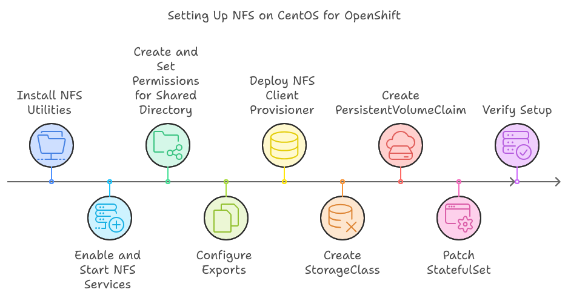

 


To achieve your goal of making files from a local directory on your CentOS machine accessible within an OpenShift pod, follow these steps:

1. **Install and Configure the NFS Server on CentOS:**
   - **Install NFS Utilities:**
     ```bash
     sudo yum install -y nfs-utils
     ```
   - **Enable and Start NFS Services:**
     ```bash
     sudo systemctl enable --now rpcbind
     sudo systemctl enable --now nfs-server
     ```
   - **Create and Set Permissions for the Shared Directory:**
     ```bash
     sudo mkdir -p /nfs-share
     sudo chown -R nfsnobody:nfsnobody /nfs-share
     sudo chmod 777 /nfs-share
     ```
   - **Configure Exports:**
     Edit `/etc/exports` to include:
     ```
     /nfs-share *(rw,sync,no_root_squash)
     ```
     Then, apply the export settings:
     ```bash
     sudo exportfs -ra
     ```
     This configuration allows all clients to read and write to the shared directory.

2. **Set Up Dynamic NFS Provisioning in OpenShift:**
   - **Deploy the NFS Client Provisioner:**
     The NFS Client Provisioner automates the creation of PersistentVolumes (PVs) backed by NFS.
     - **Create a Deployment Configuration:**
       Save the following YAML to a file named `nfs-client-provisioner.yaml`:
       ```yaml
       apiVersion: apps/v1
       kind: Deployment
       metadata:
         name: nfs-client-provisioner
         namespace: openshift-storage
       spec:
         replicas: 1
         selector:
           matchLabels:
             app: nfs-client-provisioner
         template:
           metadata:
             labels:
               app: nfs-client-provisioner
           spec:
             containers:
               - name: provisioner
                 image: quay.io/external_storage/nfs-client-provisioner:latest
                 volumeMounts:
                   - mountPath: /persistentvolumes
                     name: nfs-client-root
                 env:
                   - name: PROVISIONER_NAME
                     value: nfs-provisioner
                   - name: NFS_SERVER
                     value: <NFS_SERVER_IP>
                   - name: NFS_PATH
                     value: /nfs-share
             volumes:
               - name: nfs-client-root
                 nfs:
                   server: <NFS_SERVER_IP>
                   path: /nfs-share
       ```
       Replace `<NFS_SERVER_IP>` with the IP address of your CentOS machine.
     - **Apply the Deployment:**
       ```bash
       oc apply -f nfs-client-provisioner.yaml
       ```
     This deployment sets up the NFS Client Provisioner to manage dynamic provisioning of NFS-backed PVs.

3. **Create a StorageClass for NFS:**
   - **Define the StorageClass:**
     Save the following YAML to a file named `nfs-storageclass.yaml`:
     ```yaml
     apiVersion: storage.k8s.io/v1
     kind: StorageClass
     metadata:
       name: nfs
     provisioner: nfs-provisioner
     ```
   - **Apply the StorageClass:**
     ```bash
     oc apply -f nfs-storageclass.yaml
     ```
     This StorageClass tells OpenShift to use the NFS Client Provisioner for dynamic provisioning.

4. **Create a PersistentVolumeClaim (PVC) in Your Application's Namespace:**
   - **Define the PVC:**
     Save the following YAML to a file named `pvc.yaml`:
     ```yaml
     apiVersion: v1
     kind: PersistentVolumeClaim
     metadata:
       name: app-pvc
       namespace: webfocus
     spec:
       accessModes:
         - ReadWriteMany
       resources:
         requests:
           storage: 10Gi
       storageClassName: nfs
     ```
   - **Apply the PVC:**
     ```bash
     oc apply -f pvc.yaml
     ```
     This PVC requests 10Gi of storage using the NFS StorageClass.

5. **Patch the StatefulSet to Mount the PVC:**
   - **Patch the StatefulSet:**
     ```bash
     oc patch statefulset edaserver -n webfocus --type='json' -p='[{"op": "add", "path": "/spec/template/spec/volumes/0", "value": {"name": "app-storage", "persistentVolumeClaim": {"claimName": "app-pvc"}}},{"op": "add", "path": "/spec/template/spec/containers/0/volumeMounts/0", "value": {"name": "app-storage", "mountPath": "/path/in/container"}}]'
     ```
     This command adds a volume to the StatefulSet and mounts it at `/path/in/container` inside the pod.

6. **Verify the Setup:**
   - **Check the PVC Status:**
     ```bash
     oc get pvc app-pvc -n webfocus
     ```
     Ensure the PVC is bound to a PV.
   - **Check the Pod's Volume Mount:**
     ```bash
     oc describe pod <pod-name> -n webfocus
     ```
     Verify that the volume is mounted at the specified path inside the container.

By following these steps, you will have configured an NFS server on your CentOS machine, set up dynamic provisioning in OpenShift, and mounted the NFS share into your application's pod. 