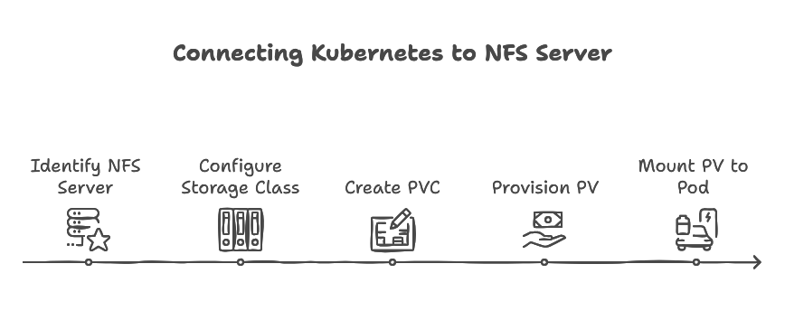

# NFS Setup and Persistent Volume Configuration for Kubernetes

## Introduction



In this document, we will explain how to connect Kubernetes (in this case, CRC OpenShift) with an NFS server. The NFS server can either be hosted on the same machine as the single-node cluster or on a separate machine. It does not matter whether the NFS server is running on Ubuntu or RHEL.

The process involves using a Kubernetes Storage Class that is configured to connect to the NFS server, which includes all necessary NFS connectivity details. Once the Storage Class is set up and configured, we create a Persistent Volume Claim (PVC) that references this Storage Class. The PVC then provisions a Persistent Volume (PV). Finally, we mount the PV to a pod to verify connectivity and check if the files from the NFS server are accessible.

## Prerequisites
- An Ubuntu system to install and configure NFS
- Helm installed on your local machine
- A Kubernetes cluster running with access to the namespace where you want to deploy the Persistent Volume
- The `oc` command-line tool (for OpenShift)

## Steps to Set Up NFS and Kubernetes Persistent Volume

### 1. Install NFS Utilities

Get your NFS Server IP Address we will need this now on

```bash
# Run this command on the machine where NFS server is going to be installed
hostname -I
```
We will refer to above IP as `nfs-server-ip-address` going forward

Run the following commands to install the necessary NFS utilities:

```bash
sudo apt update
sudo apt install -y nfs-kernel-server
```

### 2. Create a Directory to Share
Create a directory that will be shared over NFS:

```bash
sudo mkdir -p /srv/nfs/data
sudo chmod 777 /srv/nfs/data
```

**Note:** `/srv/nfs/data` is the directory we have chosen to share, but you can modify it to fit your needs. We decided to use `/srv/nfs/data` as an example in this guide.

### 3. Edit the Exports File
To make the directory available for sharing, add the directory path to the `/etc/exports` file:

For this command replace `<k8s_node_ip>` with the IP address of the node where the NFS client will be running.  
⚠️ If you don't provide the IP address of the node where the NFS client will be running, the NFS client will not be able to access the NFS server.
```bash
# Example echo "/srv/nfs/data 10.65.50.24(rw,sync,no_subtree_check,no_root_squash,insecure)" | sudo tee -a /etc/exports
echo "/srv/nfs/data <k8s_node_ip>(rw,sync,no_subtree_check,no_root_squash,insecure)" | sudo tee -a /etc/exports
```

#### Explanation of the `exports` line:
- `/srv/nfs/data`: This is the directory on the NFS server that you want to share.
- `10.65.50.24`: The IP address (or network) of the machine that can access the NFS share. You can replace it with your specific client IP or subnet. This should be IP of k8s Node
- `rw`: Allows read-write access to the shared directory.
- `sync`: Ensures that changes to the shared directory are written immediately to disk.
- `no_subtree_check`: Disables subtree checking, which can improve performance for large directories.
- `no_root_squash`: Ensures that root users on the client machine have root access to the shared directory.
- `insecure`: Allows connections from clients that use port numbers greater than 1024, which is often the case with NFS clients.

### 4. Apply the Exports Configuration
Restart the NFS service to apply the changes:

```bash
sudo exportfs -a
sudo systemctl restart nfs-kernel-server
```

### 5. Verify the NFS Export
Check that the directory is shared:

```bash
sudo exportfs -v
```

This command will show the exported directories and their configuration. The output should look something like this:

```bash
# Example /srv/nfs/data 10.65.50.24(rw,sync,no_subtree_check,no_root_squash,insecure)
/srv/nfs/data <k8s_node_ip>(rw,sync,no_subtree_check,no_root_squash,insecure)
```

### 6. Test the Connection to the NFS Server
Ensure that the NFS share is accessible from the outside of NFS Server. 

#### Use showmount for NFSv3:

You can use the `showmount` command to check the NFS shares from the NFS server. Run the following command:

```bash
showmount -e <nfs-server-ip-address>
```

This command will show the NFS shares from the NFS server. The output should list the shared directories, like this:

```
Export list for <nfs-server-ip-address>:
/srv/nfs/data 10.65.50.24
```

`showmount` can be used to show NFS shares only if you are using rpcbind. With NFSv4, rpcbind is not used any more so showmount will throw clnt_create: RPC: Program not registered error on NFSv4 server configuration.

#### Use rpcinfo for NFSv4:

You can use rpcinfo to check whether the NFS service is running and if NFSv4 is being used.
The rpcinfo command is useful for querying remote RPC services, including NFS. This can help you check the NFS server status even if you're using NFSv4 (since NFSv4 no longer uses rpcbind for exports).

```bash
rpcinfo -p <nfs-server-ip-address>
```

This will return a list of available services, including NFS, showing the version of NFS being used (NFSv4 should show up if it's being used).

Sample output 

```bash
rpcinfo -p <nfs-server-ip-address>        
   program vers proto   port  service
    100000    4   tcp    111  portmapper
    100000    3   tcp    111  portmapper
    100000    2   tcp    111  portmapper
    100000    4   udp    111  portmapper
    100000    3   udp    111  portmapper
    100000    2   udp    111  portmapper
    100024    1   udp  40075  status
    100024    1   tcp  60417  status
    100005    1   udp  51429  mountd
    100005    1   tcp  42423  mountd
    100005    2   udp  46687  mountd
    100005    2   tcp  53687  mountd
    100005    3   udp  51296  mountd
    100005    3   tcp  51977  mountd
    100003    3   tcp   2049  nfs
    100003    4   tcp   2049  nfs
    100227    3   tcp   2049
    100021    1   udp  34402  nlockmgr
    100021    3   udp  34402  nlockmgr
    100021    4   udp  34402  nlockmgr
    100021    1   tcp  45717  nlockmgr
    100021    3   tcp  45717  nlockmgr
    100021    4   tcp  45717  nlockmgr
```

How to read above output : 

- NFSv4 Support: Your NFS server supports both NFSv3 and NFSv4, with the NFS service running on port 2049.
- rpcbind is still required for services like mountd and nlockmgr, which are used for NFSv3 and locking purposes. However, NFSv4 does not require rpcbind for exports or mounts.
- Testing Connectivity: To test if the NFS server is accessible from a client, you can run rpcinfo -p <nfs-server-ip-address> to check for NFS services. If everything is configured correctly, the NFS service and the necessary RPC services should appear in the output.

### 7 Test connectivity from kubelet node to NFS server

You can use the following command to verify that your Kubernetes cluster (K8s) can connect to an NFS server. This command runs two checks:

1. **`rpcinfo`**: This checks if the NFS server's RPC services are available and functioning.
2. **`showmount`**: This lists the NFS shares available from the NFS server.

The command will return the NFS service status and show the directories exported by the server, providing confirmation that your Kubernetes node can communicate with the NFS server.

### Command:

```bash
kubectl run nfs-check-pod --image=alpine:latest --restart=Never \
  --env="NFS_SERVER_IP=<nfs-server-ip>" \
  -it --rm --command -- /bin/sh -c "apk add --no-cache -q nfs-utils && \
  rpcinfo -p \$NFS_SERVER_IP && echo '------------------------' && \
  showmount -e \$NFS_SERVER_IP"
```

### Explanation:

- **`kubectl run nfs-check-pod`**: This command creates a temporary Pod called `nfs-check-pod` in the Kubernetes cluster.
- **`--image=alpine:latest`**: Uses the lightweight **Alpine Linux** image to run the container.
- **`--restart=Never`**: The pod is not restarted after completing the commands.
- **`--env="NFS_SERVER_IP=<nfs-server-ip>"`**: The IP address of the NFS server is passed as an environment variable. Replace `<nfs-server-ip>` with the actual IP of your NFS server.
- **`apk add --no-cache -q nfs-utils`**: Installs the necessary `nfs-utils` package silently (without verbose output).
- **`rpcinfo -p \$NFS_SERVER_IP`**: Runs the `rpcinfo` command to check if the NFS RPC services are reachable and functioning.
- **`showmount -e \$NFS_SERVER_IP`**: Displays the list of directories exported by the NFS server.
- **`-it`**: Runs the pod interactively, allowing you to view the output directly.
- **`--rm`**: Automatically deletes the pod after the command completes.

### Sample output 

```powershell
kubectl run nfs-check-pod --image=alpine:latest --restart=Never \
  --env="NFS_SERVER_IP=10.65.50.24" \
  -it --rm --command -- /bin/sh -c "apk add --no-cache -q nfs-utils && \
  rpcinfo -p \$NFS_SERVER_IP && echo '------------------------' && \
  showmount -e \$NFS_SERVER_IP"
If you don't see a command prompt, try pressing enter.
   program vers proto   port  service
    100000    4   tcp    111
    100000    3   tcp    111
    100000    2   tcp    111
    100000    4   udp    111
    100000    3   udp    111
    100000    2   udp    111
    100024    1   udp  40075
    100024    1   tcp  60417
    100005    1   udp  51429
    100005    1   tcp  42423
    100005    2   udp  46687
    100005    2   tcp  53687
    100005    3   udp  51296
    100005    3   tcp  51977
    100003    3   tcp   2049
    100003    4   tcp   2049
    100227    3   tcp   2049
    100021    1   udp  34402
    100021    3   udp  34402
    100021    4   udp  34402
    100021    1   tcp  45717
    100021    3   tcp  45717
    100021    4   tcp  45717
------------------------
Export list for 10.65.50.24:
/srv/nfs/data 10.65.50.24
pod "nfs-check-pod" deleted
```

### Notes:

- **Skipping the Step**: If you are confident that the connectivity between your Kubernetes cluster and the NFS server is already functioning, you can skip this step. It’s mainly for verifying the network and NFS setup between K8s and the NFS server.
- **Image Pulling**: The command pulls the `alpine:latest` image from the Docker Hub (the public container registry) if it is not already available in your local cluster. This step requires internet access to fetch the image. If you have concerns about pulling the image from the internet, you can either use a pre-pulled image in your cluster or run this step in an environment that allows image pulls.
  
By running this command, you will get immediate feedback on the connection and the NFS exports from the NFS server.

### 7. Deploy the NFS Subdir External Provisioner

#### Add the Helm Chart Repository
On your local machine, where Helm is installed, add the repository:

```bash
helm repo add nfs-subdir-external-provisioner https://kubernetes-sigs.github.io/nfs-subdir-external-provisioner/
helm repo update
```

#### Install the Provisioner
Replace `<nfs-server-ip-address>` and `/srv/nfs/data` with the NFS server's IP and path:

```bash
helm install nfs-provisioner nfs-subdir-external-provisioner/nfs-subdir-external-provisioner   --set nfs.server=<nfs-server-ip-address>   --set nfs.path=/srv/nfs/data
```

**Note:** This will install the NFS client.

What does this do?
Creates a Deployment in the default namespace (by default) named nfs-provisioner-nfs-subdir-external-provisioner.
The deployment runs a pod with the NFS Subdir External Provisioner that mounts the NFS share located at <nfs-server-ip-address>:/srv/nfs/data.

### 8. Create a PersistentVolumeClaim (PVC) in Your Application's Namespace

#### Define the PVC
Save the following YAML to a file named `pvc.yaml`:

```yaml
apiVersion: v1
kind: PersistentVolumeClaim
metadata:
  name: app-pvc
  namespace: webfocus
spec:
  accessModes:
    - ReadWriteOnce
  resources:
    requests:
      storage: 10Gi
  storageClassName: nfs-client
```

#### Apply the PVC
```bash
oc apply -f pvc.yaml
```

### 9. Check the PVC Status
Run the following command to ensure the PVC is bound to a PersistentVolume:

```bash
oc get pvc app-pvc -n webfocus
```

### 10. Patch the StatefulSet to Mount the PVC
Patch the StatefulSet to mount the PVC to your pod:

```bash
oc patch statefulset edaserver -n webfocus --type='json' -p='[{"op": "add", "path": "/spec/template/spec/volumes/0", "value": {"name": "app-storage", "persistentVolumeClaim": {"claimName": "app-pvc"}}},{"op": "add", "path": "/spec/template/spec/containers/0/volumeMounts/0", "value": {"name": "app-storage", "mountPath": "/opt/ibi/srv/temp/extra"}}]'
```

### 11. Check the Pod's Volume Mount
Ensure that the volume is mounted correctly inside the container:

```bash
oc describe pod edaserver-0 -n webfocus
```

### 12. Verification Step
Create a file (e.g., `test.txt`) in the NFS mount path on your local machine (`/srv/nfs/data`). Access the `edaserver` container and verify that you can see the `test.txt` file.

```bash
# Inside the container
ls /opt/ibi/srv/temp/extra
```

## Things to Be Mindful Of
- Make sure that the NFS server IP address and path are correctly configured in the Helm chart.
- Verify that the PVC is properly bound to the PV before attempting to mount it in the StatefulSet.
- Ensure proper permissions on the shared NFS directory to avoid access issues.

## Debugging Tips
- If the NFS mount is not accessible, check the firewall settings and ensure that NFS ports are open.
- Use `showmount -e` to verify that the NFS share is visible from the client machine.
- Check the pod logs for any errors related to mounting the PVC:

### Debugging NFS Provisioner Deployment

If your NFS Provisioner pod isn’t transitioning to the **"Running"** state after installing with Helm, follow these steps to debug and resolve the issue:

### 1. **Check Pod Logs**
Use this command to view the logs of the NFS provisioner pod:

```bash
kubectl logs -l app=nfs-subdir-external-provisioner
```

Look for errors related to mounting, such as **`access denied by server`**.

### 2. **Describe the Pod**
If the pod is stuck in `Pending` or `ContainerCreating`, check its status and events:

```bash
# Try getting pod log if pod is in pending state

kubectl get pods -l app=nfs-subdir-external-provisioner

# Or try describing the deployment

kubectl describe deployments.apps -l app=nfs-subdir-external-provisioner
```

Look for errors like **`MountVolume.SetUp failed`** indicating issues with NFS volume mounting.

### 3. **Fix: Add Node IP to NFS Server**
If you see **`access denied by server`** in the logs, the Kubernetes node might not be allowed to mount the NFS share. On the NFS server, add the Kubernetes node's IP to the `/etc/exports` file:

```bash
# Replace the IP with your Kubernetes node's IP
/srv/nfs/data 10.250.56.9/24(rw,sync,no_subtree_check,no_root_squash,insecure)
```

Restart the NFS server:

```bash
sudo exportfs -a
sudo systemctl restart nfs-kernel-server
```

### 4. **Restart or Recreate the Pod**
After fixing the NFS server configuration, restart the deployment to recreate the pod:

```bash
kubectl rollout restart deployment nfs-provisioner-nfs-subdir-external-provisioner
```

This will trigger the pod to recreate with the updated configuration.

### 5. **Verify Access**
Once the pod is running, check if the NFS provisioner pod can access the NFS share check the Pod logs:

```bash
# check the pod status
kubectl get pods -l app=nfs-subdir-external-provisioner
```

---

### Notes:
- The Helm installation creates a deployment named `nfs-provisioner-nfs-subdir-external-provisioner` in the **default** namespace.
- If you encounter mounting issues, it’s often a permission issue on the NFS server. Ensure the Kubernetes node’s IP is added to the NFS exports.
- If you have concerns about pulling the image from the internet, note that the Helm installation will pull the **`alpine:latest`** image if not already present.

```bash
kubectl logs <pod-name>
```

## When NFS Server and CRC Are on Different Boxes

If your NFS server and CRC (or Kubernetes) are running on separate machines, there are a few additional things to consider:

1. **Networking:**
   - Ensure that the machines can communicate over the network (check for network/firewall issues).
   - Open the necessary ports on both machines to allow NFS communication.

2. **Ports to Open:**
   NFS typically uses the following ports, so ensure that they are open on the firewall of the NFS server:
   - **2049:** NFS server port.
   - **111:** Portmapper for RPC services (may vary).
   - **20048:** NFS lock manager (usually required for NFSv4).
   - **2049:** For NFSv4.

3. **Firewall Configuration:**
   - Make sure that the NFS server is not blocking any incoming connections on the required ports (as mentioned above).
   - If you're using `ufw` (Uncomplicated Firewall) or another firewall, ensure the appropriate ports are allowed.

---

## Conclusion
By following these steps, you'll be able to set up an NFS server, configure Kubernetes to use it with the NFS Subdir External Provisioner, and mount it as a Persistent Volume in your application.
